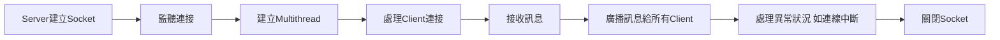

## socketchat_csharp
use socket to implement a chatroom by C#

### 使用語言及技術
C#、socket

### 執行方法 
ip皆輸入127.0.0.1，port都要一樣

### 流程

```mermaid
graph LR
  C[Server建立Socket] --> E[監聽連接]
  E --> F[建立Multithread]
  F --> G[處理Client連接]

  G --> H[接收訊息]
  H --> I[廣播訊息給所有Client]
  I --> J[處理異常狀況 如連線中斷]
  J --> K[關閉Socket]
```

### 執行結果
demo: https://www.youtube.com/watch?v=HIsIUpvIDZ8

